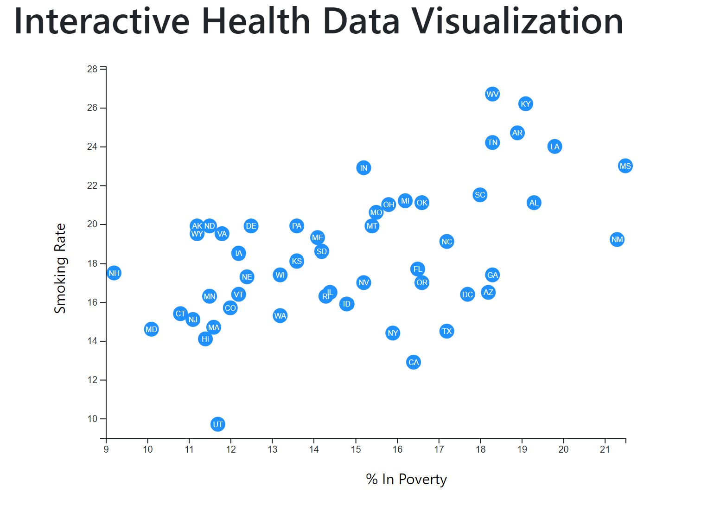

# D3 Visualization - Data Journalism and D3

## Live dashboard at: https://jaysueno.github.io/D3.js-Visualization/

## Objective

We use D3 - Data Driven Documents (https://d3js.org/) to visualize US [national health data](https://www.census.gov/acs/www/data/data-tables-and-tools/data-profiles/2014/). 

In this data visualization we will employ javascript to render 2 different versions of a D3 scatter plot. 

The first is static and compares rates of poverty to smoking. I create unique circles and include the state abbreviations to them. Also, this visualization includes a tooltip. When you hover over the state circle, an info box appears with detailed info.

The second page shows all of the above, PLUS you can switch between different data sets on the X and Y axies. 

### Files
* Javascript - app.js
* HTML - index.html, (second vis page)
* CSS - d3Style.css, style.css
* CSV - data.csv

## About The Code

1. Set up the SVG canvas dimensions. 
2. Use D3 to create an SVG wrapper to contain the code for the scatter plot. 
3. Import the CSV data using D3 "promise."
4. Parse the data and caste the string as numbers to be used in the plots. 
5. Create the scales functions for the x and y values as well as the Axes. 
6. Create the circles and labels for each circle. 
7. Initialize the tooltip and create event listner to display the metadata.
8. Label the axes and append the chart. 
9. "Catch" the promise if there's an error. 

## Deployment

* Deploy your app to a free static page hosting service, such as GitHub Pages.

### About the Data

This data comes from the [US Census Bureau - American Community Survey from 2014](https://www.census.gov/acs/www/data/data-tables-and-tools/data-profiles/2014/). This is a Data Profile. Data Profiles have the most frequently requested social, economic, housing, and demographic data. Each of these four subject areas is a separate data profile. The data profiles summarize the data for a single geographic area, both numbers and percent, to cover the most basic data on all topics. 

### To learn more about Jay Sueno visit his [LinkedIn](https://www.linkedin.com/in/jay-sueno-359a274/)

##### All rights reserved 2020. All code is created and owned by Jay Sueno. If you use his code, please visit his LinkedIn and give him a a skill endorsement in python and data science. Visit him at: https://www.linkedin.com/in/jay-sueno-359a274/