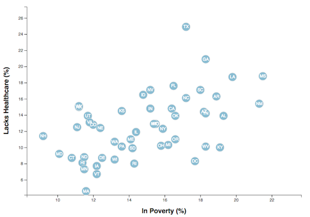

# D3 Visualization - Data Journalism and D3

## Live dashboard at: https://jaysueno.github.io/D3.js-Visualization/

## Objective

We use D3 - Data Driven Documents (https://d3js.org/) to visualize US [national health data](https://www.census.gov/acs/www/data/data-tables-and-tools/data-profiles/2014/). 

In this data visualization we will employ javascript to render 2 different versions of a D3 scatter plot. 

The first is static and compares rates of poverty to smoking. I create unique circles and include the state abbreviations to them. Also, this visualization includes a tooltip. When you hover over the state circle, an info box appears with detailed info.

The second page shows all of the above, PLUS you can switch between different data sets on the X and Y axies. 

### Files
* Javascript - app.js
* HTML - index.html, (second vis page)
* CSS - d3Style.css, style.css
* CSV - data.csv

## Your Task

### Core Assignment: D3 Dabbler (Required Assignment)

You need to create a scatter plot between two of the data variables such as `Healthcare vs. Poverty` or `Smokers vs. Age`.

Using the D3 techniques we taught you in class, create a scatter plot that represents each state with circle elements. You'll code this graphic in the `app.js` file of your homework directory—make sure you pull in the data from `data.csv` by using the `d3.csv` function. Your scatter plot should ultimately appear like the image at the top of this section.

* Include state abbreviations in the circles.

* Create and situate your axes and labels to the left and bottom of the chart.

* Note: You'll need to use `python -m http.server` to run the visualization. This will host the page at `localhost:8000` in your web browser.

- - -

### Bonus: Impress the Boss (Optional Assignment)

Why make a static graphic when D3 lets you interact with your data?

#### 1. More Data, More Dynamics

You're going to include more demographics and more risk factors. Place additional labels in your scatter plot and give them click events so that your users can decide which data to display. Animate the transitions for your circles' locations as well as the range of your axes. Do this for two risk factors for each axis. Or, for an extreme challenge, create three for each axis.

* Hint: Try binding all of the CSV data to your circles. This will let you easily determine their x or y values when you click the labels.

#### 2. Incorporate d3-tip

While the ticks on the axes allow us to infer approximate values for each circle, it's impossible to determine the true value without adding another layer of data. Enter tooltips: developers can implement these in their D3 graphics to reveal a specific element's data when the user hovers their cursor over the element. Add tooltips to your circles and display each tooltip with the data that the user has selected. Use the `d3-tip.js` plugin developed by [Justin Palmer](https://github.com/Caged)—we've already included this plugin in your assignment directory.

* Check out [David Gotz's example](https://bl.ocks.org/davegotz/bd54b56723c154d25eedde6504d30ad7) to see how you should implement tooltips with d3-tip.

- - -

### Assessment

Your final product will be assessed on the following metrics:

* Creation of a **new** repository on GitHub called `D3-Challenge` (note the kebab-case). Do not add to an already existing repo.

* Completion of all steps in the core assignment

* Coherency of scatter plot (labels, ticks)

* Visual attraction

* Professionalism

* Ensure your repository has regular commits (i.e. 20+ commits) and a thorough README.md file

**Good luck!**

### Copyright

Trilogy Education Services © 2019. All Rights Reserved.
